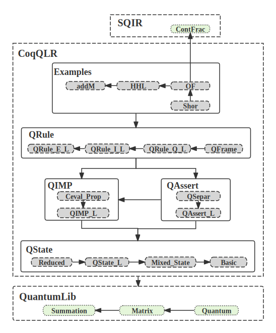

# Introduction 

This is a project about a Hoare Logic for Local reasoning about quantum programs. 

# Installation 

coqQ_LR is currently compatible with Coq 8.16---8.19.

First, download the project: 

```git clone https://github.com/fox9909/C_Q_LocalReasoning.git``` 

Then, cd to the root of the project directory and enter the following commands in the commandline:

```coq_makefile -f _CoqProject -o Makefile```

A file named Makefile will be generated. After that, enter ```make``` in the commandline. If no error message occurs, the installation is complete.
# Structure



* **Quantumlib**: A project about Coq library for reasoning about quantum programs realized by [QuantumLib](https://github.com/inQWIRE/QuantumLib.git). We primarily utilize three key folders from it: 
  + **Summation**: about summation operations.
  + **Matrix**: about matrix computations.
  + **Quantum**: about quantum computing. 

* **QState**: A folder about state.

  + **Basic**:  Definition of basis vector and corresponding lemmas.

  + **Mixed_State**: Definitions of partial density operator and corresponding lemmas.

  + **QState_L**:  Definitions of classical states, quantum states, states, and distribution states, along with associated lemmas.

  + **Reduced**: A docutment about the restriction of states and associated lemmas.

* **QIMP**: A folder about classical-quantum languages.

    + **QIMP_L**: A docutment about the syntax and semantics of classical-quantum languages.

    + **Ceval_Prop**: Some lemmas about the semantics of languages.

* **QAssert**: A folder about state.

    + **QAssert_L**: A docutment about the syntax and semantics of assertion languages, on the syntax and semantics of assertion languages, along with associated lemmas.

    + **QSepar**: Additional lemmas for assertions.

* **QRule**:  Documentation on various reasoning rules.

* **Examples**:  A folder containing various examples. 

* **ContFrac**: A file about Continued Fraction Algorithm, realized by [SQIR](https://github.com/inQWIRE/SQIR.git).
