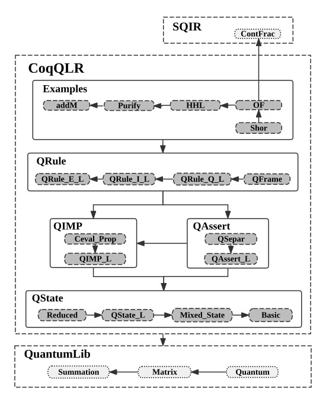

# Introduction

This project formalizes a Hoare logic for local reasoning about classical-quantum programs. The complete work can be found in our paper [Local Reasoning about Probabilistic Behaviour for Classical-Quantum Programs](https://doi.org/10.48550/arXiv.2308.04741).

# Installation

CoqQLR is currently compatible with Coq 8.18.

First, download the project:

```bash
git clone https://github.com/fox9909/CoqQLR.git
```

After that, run `make` on the command line. If no errors occur, the installation is complete.

# Structure



* **QuantumLib**: A Coq library for reasoning about quantum programs, provided by [QuantumLib](https://github.com/inQWIRE/QuantumLib.git). We primarily use three key folders from it:
  + **Summation**: summation operations.
  + **Matrix**: matrix computations.
  + **Quantum**: quantum computing.

* **QState**: State definitions and lemmas.

  + **Basic**: Definitions of basis vectors and corresponding lemmas.

  + **Mixed_State**: Definitions of partial density operators and corresponding lemmas.

  + **QState_L**: Definitions of classical states, quantum states, states, and distribution states, along with associated lemmas.

  + **Reduced**: Definitions and lemmas for state restriction.

* **QIMP**: Classical-quantum languages.

    + **QIMP_L**: Syntax and semantics of classical-quantum languages.

    + **Ceval_Prop**: Lemmas about language semantics.

* **QAssert**: Assertions.

    + **QAssert_L**: Syntax and semantics of assertion languages, along with associated lemmas.

    + **QSepar**: Additional lemmas for assertions.

* **QRule**: Reasoning rules and their soundness proofs.

* **Examples**: A folder containing various examples, including addM, HHL, OF, Shor, and Bell-pair purification. In particular, `Purify.v` formalizes correctness for both a single purification block and its extension to multiple purification blocks.

* **ContFrac**: A file about the continued fraction algorithm, based on [SQIR](https://github.com/inQWIRE/SQIR.git).
